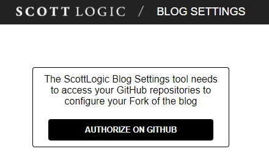
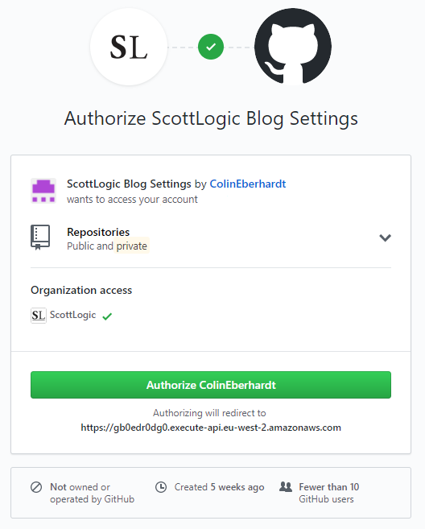
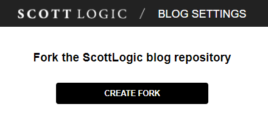
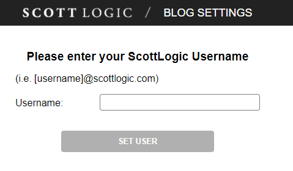
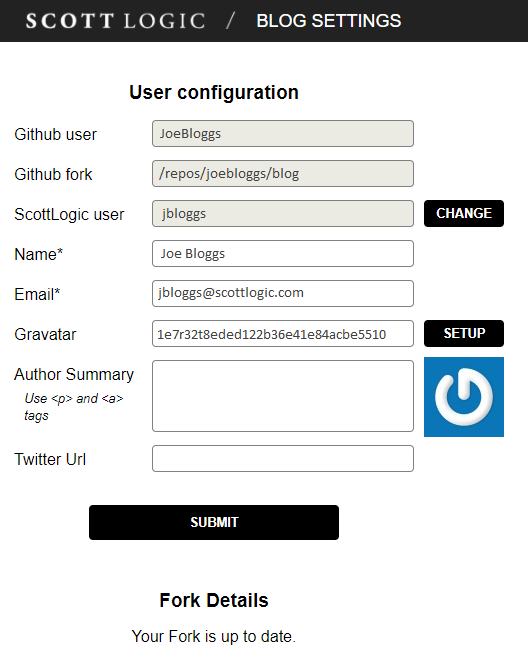
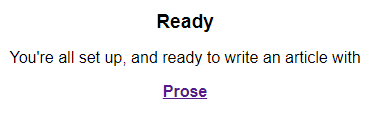
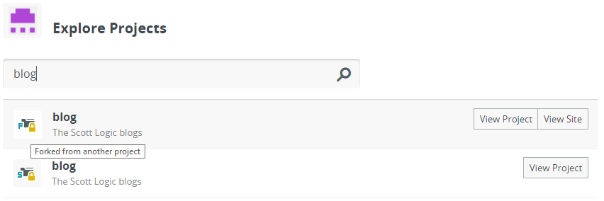
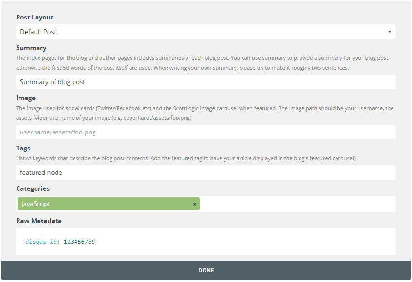

## Scott Logic Blogs

### Getting Set up
You can either follow the manual process of setting up a blog by using the [Getting a local copy to work with](https://github.com/scottlogic/blog#getting-a-local-copy-to-work-with) and [first post setup](https://github.com/scottlogic/blog#first-post-setup), or you can use the interactive tool that will do this for you.

If you go to the [Scott Logic Blog Tool](https://gb0edr0dg0.execute-api.eu-west-2.amazonaws.com/dev/), the required setup will be done for you in a few steps. First you'll need to authorise the Github ScottLogic Blog Tool app to access your account, specifically your repositories.



Click `Authorize on GitHub` and you will be redirected to `GitHub.com` where it will confirm the applications request for access and specific permissions, click `Authorize` and confirm your account password.



You will now be redirected back to the Blog Tool where it will give you the option to create a fork, click `Create Fork`.



It will ask you for your username which should be the first part of your email e.g. `jbloggs@scottlogic.com` will be `jbloggs`. Enter your username and click `Set User`.



Fill in your name and email address, if you dont have a gravatar account already then you can use the `setup` button which will open a new tab for you to register. Once you have registered with gravatar (using your scott logic email), use the `refresh` button next to `setup` to automatically fill out the gravatar box with your id.



Optionally, add an Author summary and Twitter URL and click `Submit`. This has now completed all the steps in [first post setup](https://github.com/scottlogic/blog#first-post-setup) and you should be left with a forked blog on github with a series of commits that reflect the information you have entered.

You should now see a `Ready` section at the bottom with a link to Prose, to create a blog post using prose, see the [Using Prose](https://github.com/scottlogic/blog#using-prose) section.



### Getting a local copy to work with
To author a blog post, go to the [Scott Logic Blog Repository](https://github.com/ScottLogic/blog) and click on the Fork button on the right (see [GitHub's help](https://help.github.com/articles/fork-a-repo) for more info on forking). N.B. this will trigger an email to the address associated with your GitHub account warning you about the CNAME being taken, just ignore it.

GitHub will give you your own copy of the blog repository to work with. GitHub should redirect you to the page with your own copy of the blog repository (e.g. the page says "John Smith / blog" at the top) - from this page, grab the clone URL from the box on the right of the page.

**Make sure this is the clone URL for your personal fork of the repo.**

Clone the repo by typing the following, replacing the URL with the one you copied:
```
git clone URL_FROM_ABOVE
```

N.B. Changes can also be made [directly in GitHub](https://help.github.com/articles/editing-files-in-your-repository/).

### Creating a blog post

**If this if your first post please see [first post setup](https://github.com/scottlogic/blog#first-post-setup).**

#### Using Prose

Go to [Prose](http://prose.io), it will prompt you to authorise Prose using github and ask you for your password, enter and proceed.

After authorising prose, you should see the `Explore Projects` page. Using the `Filter Projects` bar search for `blog` and you should see at least two items, one is your forked repository and one is the original, you need to select the forked version which is indicated by a small 'F' in the lower left of the folder icon (You can also hover over the icon and it should tell you if its forked).



Click the `New File` button.

You should be able to change the blog post title from `Untitled` at the top of the page.
>The post name should be formatted as: [Current date: YYYY-MM-DD]-[post name]

On the right hand side you should see a set of action buttons, Edit, Preview, Meta Data and Save.

The Meta Data button allows you to enter your post tags, summary, categories into textboxes and any additional will need to be added to the Raw metadata in the form of `key:value`, see [Optional post meta-data](#optionalmetadata) below for more information.



You should be able to flip between preview and edit whilst writing your blog. When you are done editing the post, you can save it by clicking the `save` button on the right hand side. This will commit the new file and any associated images to your fork ready for a pull request. Before the save is finalised it will give you a chance to write a commit message, this is optional.

#### Manual Editing

Blog posts can be written in either HTML or markdown. Markdown is processed via Kramdown, with the the details of the (very simple) formatting found on in the [official quick reference](https://kramdown.gettalong.org/quickref.html).

The post name should be formatted as: [Current date: YYYY-MM-DD]-[post name].

For example: 2015-11-05-how-to-name-things.

The post meta-data should be located at the top of each as follows:
```
---
post meta-data  
---  
post contents, markdown/html  
```
Note that meta-data takes the form of [front-matter](https://jekyllrb.com/docs/frontmatter/).

##### Mandatory post meta-data
* **author** - This should be your author name, which will be your Scott Logic 'name', i.e. first-letter-of-forename and surname. This should match the author meta-data in ```_config.yml```.  
* **title** - The title of the blog post (quotes are not required).
* **layout** - This informs Jekyll of the page template to use for this file. If you don't know which layout to use, you should use ```default_post```.

##### <a name="optionalmetadata"></a> Optional post meta-data
* **summary** - The index pages for the blog and author pages includes summaries of each blog post. You can use summary to provide a **summary** for your blog post, otherwise the first 50 words of the post itself are used. When writing your own summaries, please try to make them roughly 50 words in length.
* **tags** - An array of keywords that describe the blog post contents:
  * Add the `featured` tag to have your article displayed in the blog's featured carousel.
* **image** - The image used for this article if present in the carousel.
* **title-short** - An optional abbreviated title for articles that appear in the featured carousel.
* **summary-short** - An optional abbreviated summary for articles that appear in the featured carousel. This summary text is only displayed in 'large' carousel tiles.
* **disqus-id** - A unique ID for the Disqus thread. If this is left blank the page's URL path will be used instead.
* **originalArticleLink** - A URL to the original content. This is only needed if the blog post is just a reference to an article/blog in another location. Including this link will disable the page's Disqus thread so that readers post comments on the original content.
* **categories** - An array of categories for the post. These are added to the `<categories>` tag on the post's RSS & Atom feed entries.
* **contributors** - An array of author identifiers who also contributed to the post.

##### Legacy post meta-data (not needed)
* **oldlink** - This is a blog post's original link; I.E. including the canonical domain at the time the post was published, this ensures Twitter counts/Disqus threads still work; new posts (any posts published after the migration) don't need this. It may be useful for future migrations.
* **id** - A legacy property that used on our old WordPress site.
* **source** - Unknown.

##### Linking to assets

To link to any [assets hosted with the blog](https://github.com/ScottLogic/blog#first-post-setup), you should make use of `{{ site.github.url }}` to form the link.

On a fork, `{{ site.github.url }}` will return : `http://username.github.io/repository-name`; in the main repo, it will return: `http://blog.scottlogic.com`. This allows for images to be linked to correctly, both on forks and the main blog.

N.B. `site.baseurl` no longer exists - please use `site.github.url` instead.

For example, to link to this image `/jbloggs/assets/my-image.png`, with **HTML**:

```html

```

Or **Markdown**:

```markdown

```

### First post setup
Before your first post you will need to:  
* Create an author folder with the following file structure:
```
username  
|   atom.xml  
|   feed.xml  
|   index.html  
+---assets  
|   |   // Put images for posts here  
|   +---featured  
|          // Put images for featured articles here  
+---_posts
        // Put blog posts here
```

* ```index.html``` is your author page, which requires the following meta-data:

```yml
---
author: username
title: Firstname Lastname
layout: default_author
---
```

* ```atom.xml``` takes the form:  

```yml
---  
author: username  
layout: atom_feed  
---  
```

* ```feed.xml``` takes the form:

```yml
---  
author: username  
layout: rss_feed  
---  
```

* Edit the ```/_data/authors.yml``` file and add your username (i.e. folder name) to ```active-authors``` and your details to ```authors```.

When adding your details to authors you'll need to add the following:

* **name**
* **email**
* **author-summary** - A paragraph of two about the author that will be displayed on their author page.
* **feed-description** - A short description that will be added to the description of the author's Atom and RSS feed.
* **gravatar** - The author's [gravatar hash](https://en.gravatar.com/site/implement/hash/). This is an [md5 hash](http://www.miraclesalad.com/webtools/md5.php) of your email address in lower case. If you don't have a gravatar account you'll need to [sign up](https://en.gravatar.com/) for one.
* **twitter-url** - The author's Twitter account.
* **google-plus-url** - The author's Google+ url.
* **author-summary** - A short paragraph introducing the author.

Finally, edit ```prose.yml```, adding yourself to the users section. The `login` field is your GitHub username, while the `user` is the username added it the ```authors.yml``` file.

### Testing
To test that your post works and looks as expected, push your changes to your GitHub repository, entering your username/password when prompted:
```
git push origin gh-pages
```

N.B. If you use 2-factor authentication, make sure you [generate an application token](https://help.github.com/articles/creating-an-access-token-for-command-line-use/) to use instead of your password. Credentials can be [cached locally](https://help.github.com/articles/caching-your-github-password-in-git/#platform-windows).

After pushing, GitHub will generate the site at http://USERNAME.github.io/blog/ which you can use to view your changes. If this is the first time pushing the blog repo, GitHub may take up to 10 minutes to generate the site. Changes made in subsequent pushes should be visible almost immediately.

If the site fails to build, GitHub will send you an email letting you know about the failure.

There are some restrictions with loading external resources on forks; some fonts, Twitter share counts, Disqus comment counts and Disqus threads will not load on the forked versions of the blog (these may appear are errors in you console).

### Spelling
As part of the submission, spelling is automatically checked. To do this yourself, run `npm install` and `npm test`. Any spelling errors should be printed out.

If there's a word that's classed as incorrectly spelled and you want it to be classed as correct there are a couple of ways in which you can do this.

#### Via the mdspell interactive tool

The preferred route is to use the interactive `mdspell` tool. You can do this by running

`npm run spellcheck`

This will spell check all of the files allowing you to add words to the global or local (author specific) `.spelling` file. For local, use the `[Relative]` option at the arrow-key prompt.

#### Manual

You can edit the `.spelling` file manually by adding the following:

```
# Note the space before and after the '-'.
 - path/to/blog/post.md
Some
words
like
mkdir
expressjs
etc
```

If there's a word that's classed as incorrectly spelled and there's a special character in it (eg. `sending*something*spelllllingmistake`), the special characters act as spaces. Therefore you can add in `spelllllingmistake` as a special word and it should work.

### Deploying to the Scott Logic website
To get your blog posts on the Scott Logic website, go to your personal GitHub fork of the repository (likely at https://github.com/USERNAME/blog) and click 'Pull Requests' on the right hand side, and then 'Create pull request'. This will create a request to pull your changes into the original blog repository, and automatically notify the blog team. Once they hit the OK button, it'll be pulled in and deployed to http://blog.scottlogic.com/.

### Featured Articles
Featured articles are selected at the discretion of Colin Eberhardt (bribes accepted). The general idea is to feature popular articles from the past ~6 months, or articles that we think are particularly interesting, important, or are from people who have just started contributing.  

To make an article appear on the featured carousel, simply add the `featured` tag to your post. The featured carousel will show the 10 most recent `featured` blogs.

### Community and announcements
* Join the ```#blog``` channel on Slack. This is a great place to ask for help.
* Join the ```bloggers``` email distribution list. Raise an IT ticket to have yourself added to this list.  

### Comments and notifications
When you have posted your first blog post, you should consider signing up for Disqus so that you can interact with people who comment on your blog posts. Once you have created an account you need to be added to the ```Scott Logic Ltd``` site. Raise an IT ticket for this. Once you are added to the Scott Logic site you might want to change your notification settings so that you receive an email whenever someone comments on the site.

### Developing

The site is built on [Jekyll](http://jekyllrb.com/) and hosted on [GitHub pages](https://pages.github.com/).

Follow the [instructions above](#getting-a-local-copy-to-work-with) for obtaining a local copy of the repository (fork; clone; pull request).

#### Running Jekyll locally

For most tasks, running Jekyll locally isn't required. If it is, then follow the instructions from [Jekyll](http://jekyllrb.com/docs/installation/) and [GitHub](https://help.github.com/articles/using-jekyll-with-pages/#installing-jekyll) for local installation or you can run a local instance of github-pages in docker using the following command and browsing to port `4000` at your docker-machine's ip:

```
docker run -v /path/to/blog/project:/usr/src/app -p "4000:4000" starefossen/github-pages:latest bundle exec jekyll serve --host 0.0.0.0
```

Please note:
* The [repository metadata](https://help.github.com/articles/repository-metadata-on-github-pages/) is not available if you build the site locally, one solution is to temporarily add the required variables to `_config.yml`.
* As many resources expect to be loaded from `scottlogic.com`, it is a good idea to serve the site from this domain (e.g. `blog.scottlogic.com`).
* `path/to/blog/project` is the directory on your docker-machine where the blog project files are mounted.
* To mount a Windows host directory in a docker container using Boot2Docker follow [this example](https://tuhrig.de/mount-windows-folder-to-boot2docker-vm/).


#### CSS & Scripts

You can compile the SCSS into CSS as follows:

```
npm run style
```

And concat / minify the JS as follows:

```
npm run scripts
```
