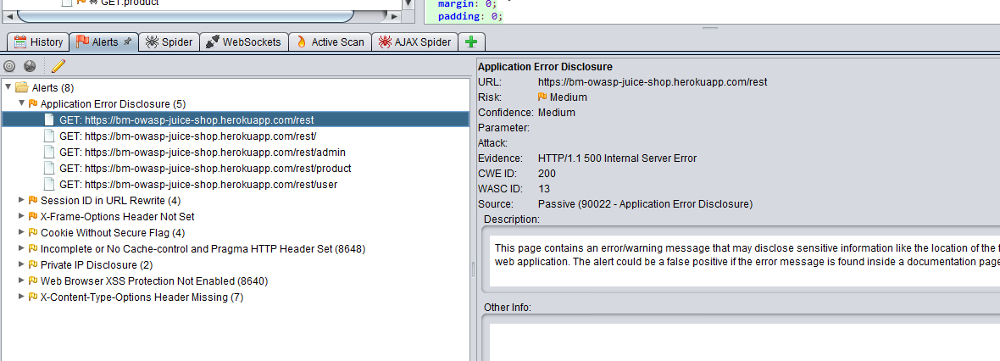

## Automatic website Security Testing while you manually test

As a Software Tester, I spend a lot of time executing manual tests on websites. I recently discovered a really simple way to incorporate Security Testing into your Manual Testing workflow  - the bonus is that it requires very little setup, no prior knowledge of security testing, and happens automatically in the background while you are performing your manual tests.

### Tools required
- Owasp Zap - [https://github.com/zaproxy/zaproxy/wiki/Downloads](https://github.com/zaproxy/zaproxy/wiki/Downloads)
- Owasp Juice Shop - [https://github.com/bkimminich/juice-shop](https://github.com/bkimminich/juice-shop)

**Owasp Zap** is an open source Security Testing tool. This tool is used by experienced Penetration Testers and is packed with a range of useful tools. For this blog post, we’re going to use the simple, yet extremely useful, [Passive Scanner](https://github.com/zaproxy/zap-core-help/wiki/HelpStartConceptsPscan). We will configure Zap to act as a proxy between a browser and a server which will allow Zap to  scan all of the HTTP request and response messages.

**Owasp Juice Shop** is your own private, intentionally insecure web application which makes it great to practice Security Testing on without getting into trouble. This is an optional requirement - if you already have a local website running on your machine that you want to test on, then use that instead.

### Preparation
1. [Install](https://github.com/zaproxy/zaproxy/wiki/Downloads) Zap (requires Java).
2. [Configure](https://github.com/zaproxy/zap-core-help/wiki/HelpStartProxies) your browser to use Zap as a proxy.
3. [Install](https://github.com/zaproxy/zap-core-help/wiki/HelpUiDialogsOptionsDynsslcert#install-zap-root-ca-certificate) the Zap root CA certificate into your browser's list of trusted root certificates.

### Test execution
1. Open Zap - this will automatically launch the proxy server and the passive scanner.
2. Open a browser.
3. Navigate to the website you want to test.
4. Start the manual execution of your tests.
5. Some time later, stop the manual execution of your tests.
6. Go to Zap and look in the _Alerts_ tab.

### Results
The _Alerts_ tab will display all of the issues that the passive scanner detected while you were running your manual tests. 

The alerts will be displayed in a tree structure grouped by Alert Type, and will show the number found along with the URL they occurred on. 
These will vary depending on your application but can include:
 - X-Frame-Options Header Scanner
 - Session ID in URL Rewrite
 - Cookie Without Secure Flag
 - Private IP Disclosure
 
You can click on these to get advice from Zap on how to address them, and then discuss your findings within your team. 

### Extend
There is a lot more you can do with this approach: 
- run your automated UI tests with the passive scanner on
- mobile application testing by proxying a device through your machine and Zap
- and many more. 

You can also explore the many other tools within Zap which we will do in future posts. 
